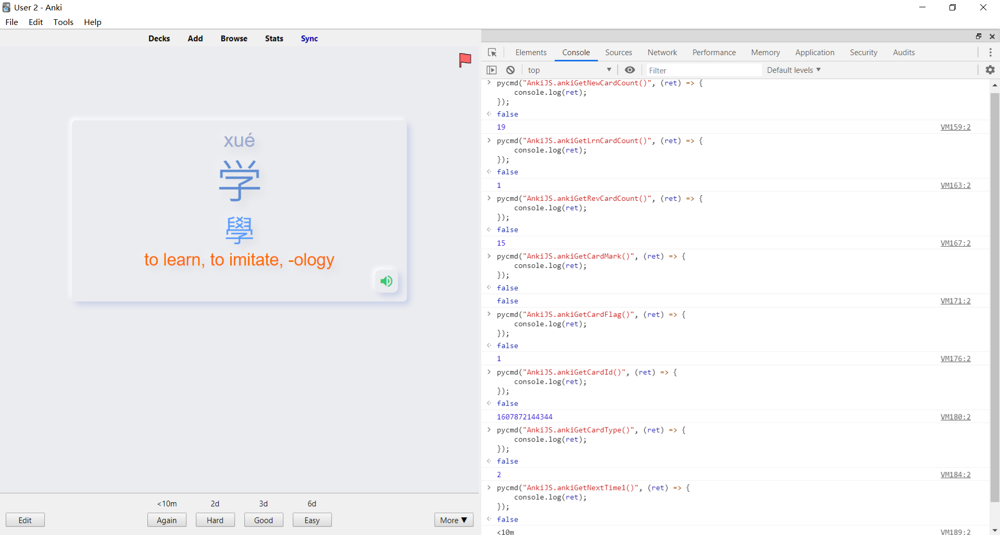

# AnkiJS-API
Anki JavaScript API to get cards information in reviewer window

This addon is made to work with [AnkiDroid JS API](https://github.com/ankidroid/Anki-Android/wiki/AnkiDroid-Javascript-API).

# Demo


# To get card info in reviewer for creating decks
To know more about the options view
[AnkiDroid JS API](https://github.com/ankidroid/Anki-Android/wiki/AnkiDroid-Javascript-API).
## New Count
```javascript
pycmd("AnkiJS.ankiGetNewCardCount()", (ret) => {
    console.log(ret);
});
```

## Learn Count
```javascript
pycmd("AnkiJS.ankiGetLrnCardCount()", (ret) => {
    console.log(ret);
});
```

## Review Count
```javascript
pycmd("AnkiJS.ankiGetRevCardCount()", (ret) => {
    console.log(ret);
});
```

## Mark
```javascript
pycmd("AnkiJS.ankiGetCardMark()", (ret) => {
    console.log(ret);
});
```

## Flag
```javascript
pycmd("AnkiJS.ankiGetCardFlag()", (ret) => {
    console.log(ret);
});
```

## Card Id
```javascript
pycmd("AnkiJS.ankiGetCardId()", (ret) => {
    console.log(ret);
});
```

## Note Id
```javascript
pycmd("AnkiJS.ankiGetCardNid()", (ret) => {
    console.log(ret);
});
```

## Deck Id
```javascript
pycmd("AnkiJS.ankiGetCardDid()", (ret) => {
    console.log(ret);
});
```

## Last modified time of card
```javascript
pycmd("AnkiJS.ankiGetCardMod()", (ret) => {
    console.log(ret);
});
```

## Type
```javascript
pycmd("AnkiJS.ankiGetCardType()", (ret) => {
    console.log(ret);
});
```

## Queue
```javascript
pycmd("AnkiJS.ankiGetCardQueue()", (ret) => {
    console.log(ret);
});
```

## Left
```javascript
pycmd("AnkiJS.ankiGetCardLeft()", (ret) => {
    console.log(ret);
});
```

## Due
```javascript
pycmd("AnkiJS.ankiGetCardDue()", (ret) => {
    console.log(ret);
});
```

## Interval
```javascript
pycmd("AnkiJS.ankiGetCardInterval()", (ret) => {
    console.log(ret);
});
```

## Factor
```javascript
pycmd("AnkiJS.ankiGetCardFactor()", (ret) => {
    console.log(ret);
});
```

## Reps
```javascript
pycmd("AnkiJS.ankiGetCardReps()", (ret) => {
    console.log(ret);
});
```

## Lapses
```javascript
pycmd("AnkiJS.ankiGetCardLapses()", (ret) => {
    console.log(ret);
});
```


## Original Due
```javascript
pycmd("AnkiJS.ankiGetCardODue()", (ret) => {
    console.log(ret);
});
```

## Deck ID of home deck if filtered
```javascript
pycmd("AnkiJS.ankiGetCardODid()", (ret) => {
    console.log(ret);
});
```


## Next Time 1
```javascript
pycmd("AnkiJS.ankiGetNextTime1()", (ret) => {
    console.log(ret);
});
```

## Next Time 2
```javascript
pycmd("AnkiJS.ankiGetNextTime2()", (ret) => {
    console.log(ret);
});
```

## Next Time 3
```javascript
pycmd("AnkiJS.ankiGetNextTime3()", (ret) => {
    console.log(ret);
});
```

## Next Time 4
```javascript
pycmd("AnkiJS.ankiGetNextTime4()", (ret) => {
    console.log(ret);
});
```